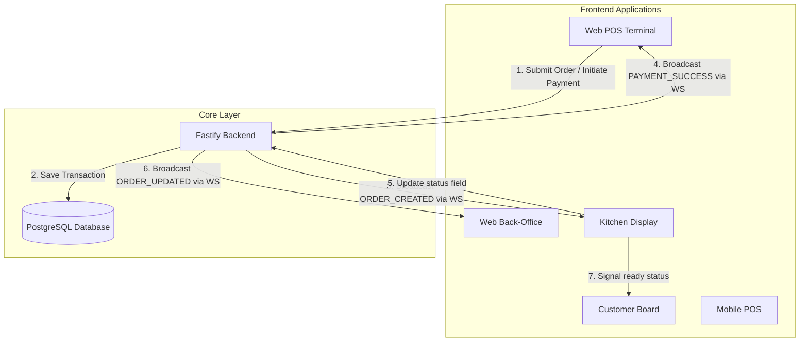

# DeMega POS Ecosystem Architecture Guide

Welcome to the **DeMega POS** technical breakdown! This document explains how all the moving parts of our platform interact to provide a seamless, real-time business management experience.

---

## 🏗️ The Core Components

Our ecosystem consists of several specialized applications that talk to each other through a central brain.

### 1. 🧠 The Backend (The Central Brain)
- **Role**: The single source of truth. It manages the database, security, and real-time communication.
- **Technology**: Fastify (Node.js) + Prisma (Database Layer) + PostgreSQL.
- **Key Function**: When a sale is made anywhere, the Backend records it and then broadcasts the event via **WebSockets** so other apps can react instantly.

### 2. 🏪 Web POS / Back-Office Terminal
- **Role**: The daily workhorse. Cashiers use this to ring up sales and managers use it for oversight.
- **Interaction**: It listens for WebSocket broadcasts. When sales are made on other terminals, stock levels decrement instantly. When a card terminal transaction completes, the checkout modal automatically resolves.

### 3. 🧑‍🍳 Web Kitchen Display (The Order Board)
- **Role**: Shows the cooking staff exactly what to prepare and in what order.
- **Interaction**: Receives new orders in real-time via WebSocket broadcasts as soon as they are submitted at the POS, without requiring manual screen refreshes.

### 4. 🔔 Web Customer Board (The Status Screen)
- **Role**: Informs customers when their order is being prepared or is ready for pickup.
- **Interaction**: Updates its status based on progress markers from the Kitchen app.

### 5. 📱 Mobile POS (The Field Terminal)
- **Role**: For field sales or when you're away from the counter.
- **Interaction**: Designed for "Offline First." It can make sales even without internet and will synchronize with the Backend once a connection is restored.

---

## ⚡ Real-Time WebSocket Sync Engine

The central Fastify backend runs a WebSocket server at `/ws` that facilitates three primary broadcast channels:
1. `ORDER_CREATED`: Dispatched when an order is first submitted. Triggered by POS, caught by Kitchen to append a new cooking card and by other POS terminals to decrement stock.
2. `ORDER_UPDATED`: Dispatched when any field (fulfillment status or paymentStatus) changes. Caught by Back-Office and Kitchen screens.
3. `PAYMENT_SUCCESS`: Dispatched when an order's `paymentStatus` transitions to `SUCCESS` (via card terminal webhook or manual entry). Caught by checkout screens to unlock the drawer and print invoices.

---

## 🚦 Payment-Split Status Architecture (Separated Tracks)

To avoid business logic corruption, we maintain a strict database separation between physical fulfillment and financial checks.

```
┌────────────────────────────────────────────────────────────────────────┐
│                              ORDER OBJECT                              │
└──────────────────────────────────┬─────────────────────────────────────┘
                                   │
         ┌─────────────────────────┴─────────────────────────┐
         ▼                                                   ▼
┌──────────────────┐                               ┌──────────────────┐
│ Fulfillment Track│                               │  Financial Track │
│  (status field)  │                               │  (paymentStatus) │
├──────────────────┤                               ├──────────────────┤
│ NEW              │                               │ PENDING          │
│ PREPARING        │                               │ SUCCESS          │
│ READY            │                               │ FAILED           │
│ COMPLETED        │                               │                  │
└────────┬─────────┘                               └────────┬─────────┘
         │                                                  │
         ▼                                                  ▼
Driven by Kitchen Staff                             Driven by Terminal/
(Prep Buttons)                                      Webhook Callback
```

### Constraints:
- Fulfillment transitions **never** mutate payment fields. A chef marking an order as `READY` does not affect whether the customer paid.
- Financial updates **never** mutate fulfillment fields. A webhook marking an order as `SUCCESS` does not change the preparation stage in the kitchen.

---

## 🏗️ Ecosystem Topology Diagram



---

## 🚀 Why This Matters (Layman's Terms)
Imagine a busy restaurant:
1. The **POS** cashier rings up an order for a cheeseburger and submits it.
2. The **Kitchen App** immediately shows "Cheeseburger (NEW)" on the screen. The kitchen crew clicks "Prepare."
3. At the same time, the POS shows "Waiting for Terminal...". The customer taps their card.
4. Monnify triggers the **Backend** webhook. The backend broadcasts `PAYMENT_SUCCESS`.
5. The POS automatically prints the receipt. The Kitchen App updates to show the order is paid, but the cooking process remains unaffected.
6. When the chef finishes cooking, they click "Ready". The Customer Board flashes: "Order #42 is Ready for Pickup!"
