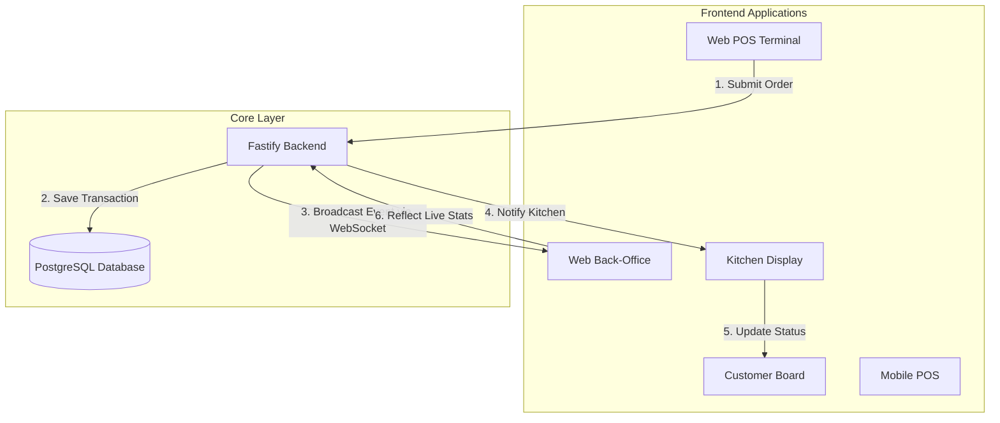

# DeMega POS Ecosystem Architecture Guide

Welcome to the **DeMega POS** technical breakdown! This document explains how all the moving parts of our platform interact to provide a seamless, real-time business management experience.

---

## 🏗️ The Core Components

Our ecosystem consists of several specialized applications that talk to each other through a central brain.

### 1. 🧠 The Backend (The Central Brain)
- **Role**: The single source of truth. It manages the database, security, and real-time communication.
- **Technology**: Fastify (Node.js) + Prisma (Database Layer) + PostgreSQL.
- **Key Function**: When a sale is made anywhere, the Backend records it and then "shouts" (broadcasts) the event via **WebSockets** so other apps can react instantly.

### 2. 🏪 Web POS (Store Terminal)
- **Role**: The daily workhorse. Cashiers use this to ring up sales.
- **Interaction**: It fetches products from the Backend. When a sale is completed, it sends the data to the Backend, which then updates stock levels.

### 3. 📊 Web Back-Office (Manager's Cockpit)
- **Role**: Business intelligence and oversight.
- **Interaction**: It listens to the Backend. As soon as a sale is recorded in the POS, the Back-Office automatically refreshes its "Total Sales" and "Stock Levels" without needing a page refresh.

### 4. 🧑‍🍳 Web Kitchen Display (The Order Board)
- **Role**: Shows the cooking staff exactly what to prepare and in what order.
- **Interaction**: Receives new orders in real-time as they are paid for at the POS.

### 5. 🔔 Web Customer Board (The Status Screen)
- **Role**: Informs customers when their order is being prepared or is ready for pickup.
- **Interaction**: Updates its status based on progress markers from the Kitchen app.

### 6. 📱 Mobile POS (The Field Terminal)
- **Role**: For field sales or when you're away from the counter.
- **Interaction**: Designed for "Offline First." It can make sales even without internet and will synchronize with the Backend once a connection is restored.

---

## ⚡ How They Interact (Summary)

---

## 🚀 Why This Matters (Layman's Terms)
Imagine a restaurant:
- The **POS** is the waiter taking an order.
- The **Backend** is the head chef coordinating everything.
- The **Kitchen App** is the line cook seeing the order.
- The **Back-Office** is the owner in the office seeing the money go into the account instantly.
- The **Customer App** is the bell ringing to say "Order ready!"

Because they are all connected to the same **Backend**, no one ever has to manually tell the other what happened—the system handles the communication automatically!
